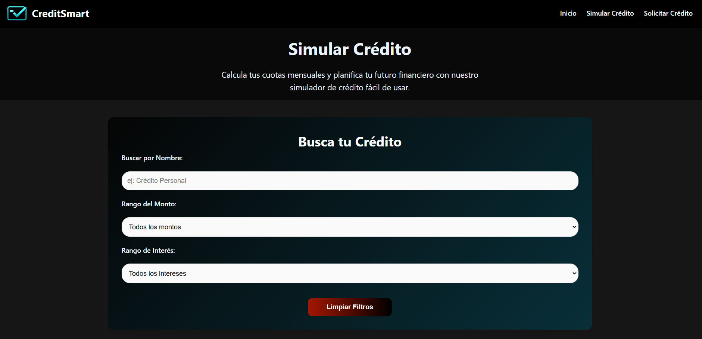

# CREDITSMART

### ESTUDIANTE: Víctor Manuel Quiceno Guerra

## DESCRIPCIÓN
CreditSmart es una plataforma web que permite a los usuarios consultar opciones de créeditos, simular préstamos y solicitar créditos en línea. Todo esto mediante una experiencia de usuario agradable.
La plataforma hace uso de recursos elegantes, minimalistas y concisos, dejando de lado complicaciones innecesarias, pensando únicamente en las necesidades de los usuarios y cómo complacerlos.

## ESTRUCTURA DE LOS ARCHIVOS

creditsmart/
├── css/
│ └── styles.css
├── images/
│ ├── credito-educativo.png
│ ├── credito-empresarial.png
│ ├── credito-libre-inversion.png
│ ├── credito-personal.png
│ ├── credito-vehiculo.png
│ ├── credito-vivienda.png
│ ├── logo.png
│ ├── ss-home1.png
│ ├── ss-home2.png
│ ├── ss-simular-credito.png
│ └── ss-solicitar-credito.png
├── videos/
│ └── banner-creditos.mp4
├── favicon.png
├── index.html
├── README.md
├── simular-credito.html
└── solicitar-credito.html

## INSTRUCCIONES PARA EJECUTAR EL PROYECTO
Abrir el archivo index en cualquier navegador de su preferencia.

## CAPTURAS DE PANTALLA

*Página principal

*Página para la simulación de créditos

*Página para solicitar créditos